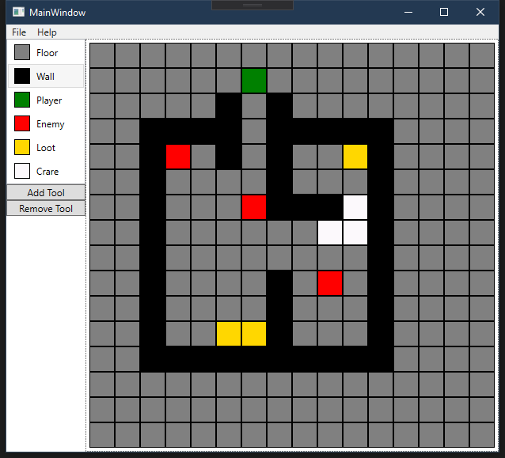

# levelEditor
2D grid level editor

## YouTube

## Built With
* [WPF](https://docs.microsoft.com/de-de/dotnet/framework/wpf/index?redirectedfrom=MSDN) - unified programming model for building line-of-business desktop applications on Windows
